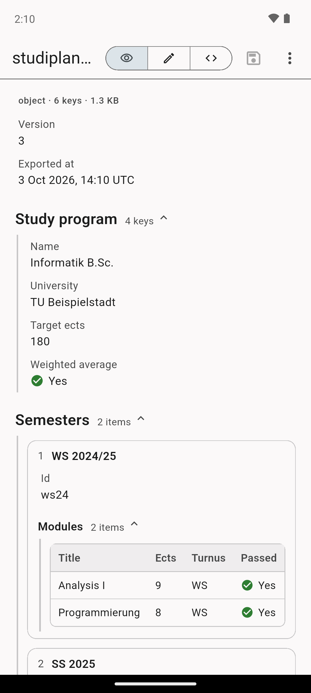
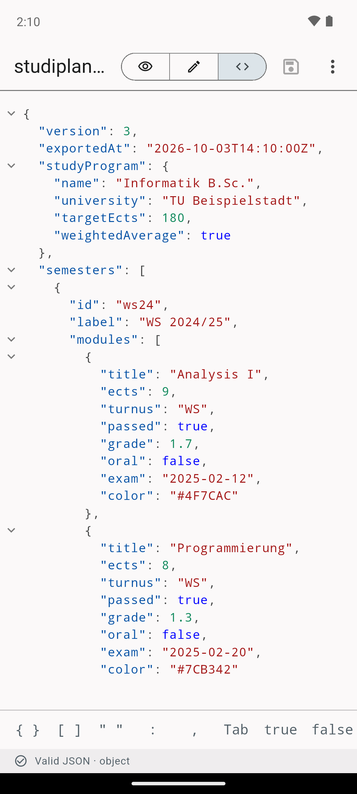
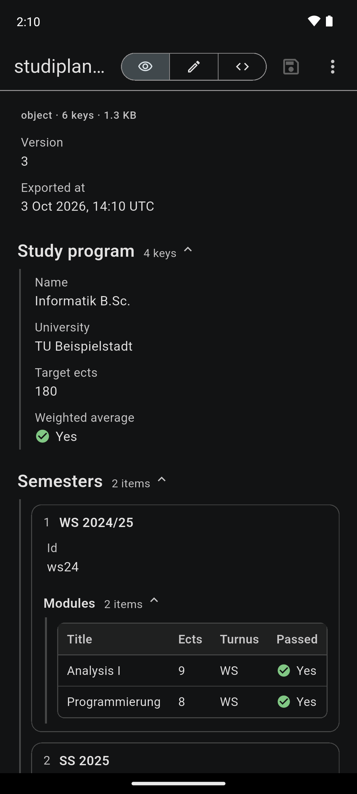

# JSON Viewer

A small Android app for viewing and editing `.json` files, the JSON
counterpart of Markdown Viewer. It shows up as an **"Open with"** option for
JSON files in file managers, mail apps and so on.

<p>
  
  
  
  
</p>
<p>
  
</p>

Screenshots are taken automatically on an Android emulator by `.github/workflows/screenshots.yml`.

## Features

Three tabs at the top, plus split view on wide screens:

| Tab | What it does |
| --- | --- |
| 👁 **View** | The JSON rendered like a document (read-only) |
| ✎ **Form** | Build or extend JSON without typing syntax |
| `</>` **Text** | The raw file, editable, with syntax highlighting |
| ◫ **Split** *(tablet / landscape)* | Text and view side by side |

- **View**
  - objects become sections with headings (`studyProgram` → "Study program"), fields label/value rows
  - lists of similar objects become tables, other lists cards (titled by `title`, `name`, …), short
    value lists chips
  - no quotes or brackets: booleans as ✓/✗, colors (`#4F7CAC`) with a swatch, ISO dates formatted, `null` as —
  - sections collapse on tap; long-press anything to copy value, path (`$.users[0].name`) or key
  - ⋮ → *Tree view*: collapsible tree with search, expand/collapse all
- **Form**
  - every field gets an input that fits its type: text, number, a Yes/No switch, "empty" for `null`
  - **Add field** (name + type: Text, Number, Yes/No, Group, List, Empty, or *Paste JSON*)
  - **Add item** in lists; for lists of objects the new item gets the same fields as the previous one
  - per field/item menu: rename, change type, duplicate, move up/down, delete; undo/redo
  - keeps the file's indentation style (spaces, tabs or minified)
- **Text**
  - fold `{…}` / `[…]` blocks with the arrows on the left (like VS Code); tap `…` to unfold,
    *Fold all* / *Unfold all* in ⋮. Folding only changes the display, never the file
  - live validation with line and column of the error (tap to jump there)
  - symbol bar for `{ } [ ] " : ,` and Format / Minify
- **Split**: scrolling one side scrolls the other (can be turned off in ⋮); tapping a value in the
  view selects it in the text
- Open from other apps ("Open with" for `.json`), share sheet, *Open file*, *New*,
  *Paste JSON* (new document from the clipboard), *Save*, *Save as…*
- Asks before throwing away unsaved changes
- A− / A+ text size, light and dark theme

## How it works

| Part | File |
| --- | --- |
| Intent filters (`application/json`, `*.json`, share sheet) | `android/app/src/main/AndroidManifest.xml` |
| Reading intents, SAF open / save as, writing back | `android/app/src/main/kotlin/com/nicolas/json_viewer/MainActivity.kt` |
| Platform channel `json_viewer/file` (Dart side) | `lib/src/file_bridge.dart` |
| Screen, modes, save / discard logic | `lib/src/viewer_page.dart` |
| Readable (rendered) view | `lib/src/readable_view.dart` |
| Tree view, search | `lib/src/json_tree_view.dart` |
| Form editor and its dialogs | `lib/src/form_editor.dart` |
| Structured edits (add, rename, move, convert, keep indentation) | `lib/src/json_edit.dart` |
| Path → text position (jump from view to editor) | `lib/src/json_locator.dart` |
| Editor, symbol bar, status line | `lib/src/json_editor.dart` |
| Parsing, errors, paths, formatting | `lib/src/json_tools.dart` |
| Syntax highlighting | `lib/src/json_highlighter.dart` |
| Editor text controller: highlighting + folding | `lib/src/json_text_controller.dart` |

The app has no third-party Dart packages. File access goes through the Android
Storage Access Framework directly, so a file opened via *Open file* or
*Save as* stays writable.

## Icon

The launcher icon is defined once in `tool/icon/icon.svg`:

- adaptive icon (API 26+, including the themed/monochrome variant):
  `res/drawable/ic_launcher_foreground.xml`, `ic_launcher_monochrome.xml`, `res/mipmap-anydpi-v26/ic_launcher.xml`
- PNGs for older Android versions and the Play Store icon (`store/icon-512.png`):
  `node tool/icon/render.js` (needs Playwright)

## Build

```sh
flutter test
flutter build apk --release --split-per-abi
```

GitHub Actions:

- `build.yml`: analyze, tests, split APKs and an App Bundle (`.aab`) as artifacts
- `screenshots.yml`: starts an Android emulator, opens `tool/screenshots/sample.json` via a
  real VIEW intent and uploads screenshots (phone light/dark, editor, search, split view,
  landscape) as the `screenshots` artifact

### Release signing

Without secrets the release build is signed with the debug key. To sign with your
upload key, add these repository secrets (*Settings → Secrets and variables → Actions*):

| Secret | Value |
| --- | --- |
| `ANDROID_KEYSTORE_BASE64` | `base64 -w0 upload-keystore.jks` |
| `ANDROID_KEYSTORE_PASSWORD` | keystore password |
| `ANDROID_KEY_ALIAS` | key alias |
| `ANDROID_KEY_PASSWORD` | key password |

Locally, create `android/key.properties` (git-ignored) with `storeFile`, `storePassword`,
`keyAlias`, `keyPassword`.
